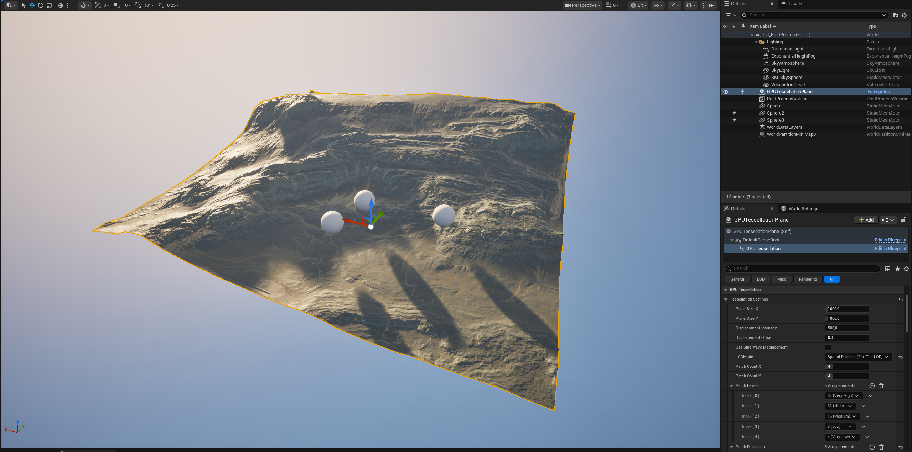
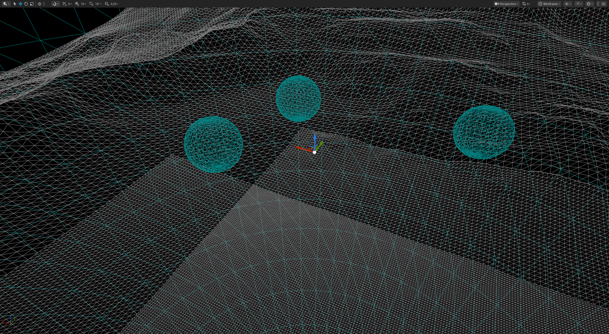
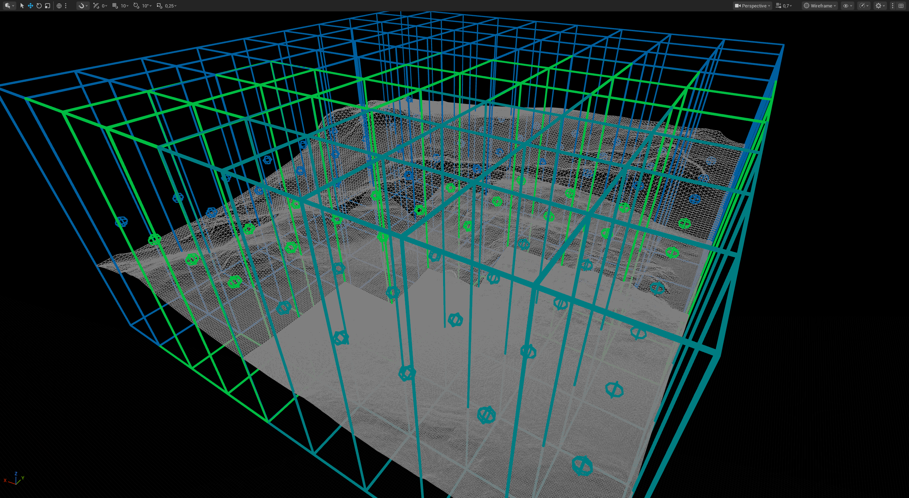

# GPU Runtime Tessellation (Compute)

[]()
[]()
[]()
[]()

Compute shader based runtime tessellation for Unreal Engine 5.7.

The plugin is actor/component driven: it builds renderable GPU geometry buffers from planar grids, static meshes, scalar height textures, vector displacement textures, and procedural ocean settings. It does not rely on UE material tessellation, hull/domain shaders, or a material custom-output node to create geometry.


## Current Status

- Experimental plugin, useful for research, prototypes, editor tools, and controlled runtime cases.
- DX12 is the primary validated RHI. Other desktop RHIs may work but still need real smoke testing.
- Rendering geometry is generated into GPU buffers and drawn from those GPU buffers. CPU work still exists for LOD decisions, render-state rebuilds, collision cooking, bake/readback paths, and gameplay queries.
- The material custom-output experiment is not the active workflow. Use the supplied actors/components and assign normal Unreal materials to the generated mesh.
- Large tessellated surfaces can be fast, but collision and editor baking can become expensive very quickly at high tessellation factors.

## Main Features

- **Planar GPU tessellation** through `UGPUTessellationComponent` and `AGPUTessellationActor`.
- **Arbitrary static mesh tessellation** through `UGPUMeshTessellationComponent` and `AGPUMeshTessellationActor`.
- **Vector displacement maps** through `UGPUVectorDisplacementComponent` and `AGPUVectorDisplacementActor`.
- **Procedural ocean displacement** through `UGPUOceanComponent`.
- **Scalar height displacement** from `UTexture2D` or `UTextureRenderTarget2D`.
- **Dynamic LOD modes** for planar grids: disabled, smooth distance, discrete distance, spatial patches, density texture WIP, and quadtree patches.
- **Static mesh LOD modes** for arbitrary mesh tessellation: disabled, distance-based tessellation factor, and distance-based static LOD factors 0-5.
- **Seven normal methods**: disabled/up vector, finite difference, geometry based, hybrid, normal map, geometry plus height texture detail, and dynamic height texture normals.
- **Collision options** for planar tessellation: height-field traces, coarse Chaos meshes, vertex-perfect GPU readback meshes, and collision LOD rings.
- **Patch/quadtree collision support** including current visual LOD matching and full-mesh patch collision baking.
- **Editor bake tools** for static mesh assets and tangent-space normal map textures.
- **Water interaction helpers** for sampling, overlap tracking, buoyancy, drag, and debug drawing.

## GPU Residency

2026-05-21: the normal visible render path is GPU-generated and GPU-resident, but the plugin as a whole is not 100% GPU-only.

- Standard planar and vector displacement components generate positions, normals, UVs, and indices in RDG compute passes.
- Generated RDG buffers are converted to persistent external pooled GPU buffers, then exposed to the custom vertex factory through SRVs and a GPU index buffer.
- The scene proxy draws `FMeshBatch` instances from those GPU buffers. It does not build a CPU vertex array for normal visible rendering.
- Patch and quadtree modes use the same GPU buffer path for generated patch geometry. CPU code still chooses patch/quadtree LOD metadata and decides when buffers need rebuilding.
- Arbitrary static mesh tessellation is hybrid: CPU code reads the source `UStaticMesh` render data, source sections, source vertices, source indices, UVs, tangents, and seam metadata, then uploads that source data to GPU buffers. The expanded/tessellated output mesh is generated and rendered from GPU buffers.
- Collision, water surface readback, static mesh baking, normal map baking, and vertex-perfect collision are not pure GPU paths. They can read generated GPU data back to CPU arrays and/or feed Chaos/editor asset creation.
- CPU height-field traces and some collision LOD ring paths intentionally use CPU-side sampled/cached data for gameplay queries.

Short version: visual tessellation rendering stays on the GPU-buffer path; tooling, physics, readback, and source mesh preprocessing still use CPU work where needed.

## Actor Workflows

The easiest workflow is to place one of the actors instead of manually attaching components.

| Actor | Use For | Backing Component |
| --- | --- | --- |
| `GPU Tessellation Actor` | Planar heightfields, large terrain planes, quadtree patches, ocean-like surfaces | `UGPUTessellationComponent` |
| `GPU Mesh Tessellation Actor` | Tessellating an existing `UStaticMesh` such as a cube, rock, prop, or imported mesh | `UGPUMeshTessellationComponent` |
| `GPU Vector Displacement Actor` | RGB/RGBA vector displacement maps that move vertices in X/Y/Z, not only along height | `UGPUVectorDisplacementComponent` |
| `GPU Ocean Component` | Procedural water surfaces driven by Gerstner, FFT/Tessendorf, or Perlin fBm displacement (place actor or create blueprint with GPU Ocean component) | `UGPUOceanComponent` |

The actors expose editor-callable buttons for the common actions:

- `Regenerate Tessellated Mesh`
- `Rebuild Collision Mesh` where the component supports cooked collision
- `Bake Current Tessellation To Static Mesh`
- `Validate Vector Displacement Texture` on vector displacement actors

## Quick Start: Planar Heightfield

1. Enable the `GPURuntimeTessellation` plugin and restart the editor.
2. Place `GPU Tessellation Actor` in the level.
3. In `GPU Tessellation`, assign a height texture or render target to `DisplacementTexture`.
4. Set `TessellationSettings.TessellationFactor`, `PlaneSizeX`, `PlaneSizeY`, `DisplacementIntensity`, and `DisplacementOffset`.
5. Choose a normal method. `Finite Difference` is fast; `Geometry Based` and `Hybrid` are safer when displacement is strong.
6. Assign a material to `Material`.
7. For runtime collision, choose a `CollisionMode` and use conservative resolution/update settings first.

Height textures are sampled from the R channel. For imported heightmaps, prefer true 16-bit source data, greyscale import, and sRGB off. Render targets are supported for dynamic painting or runtime-generated displacement.

## Quick Start: Arbitrary Static Mesh

1. Place `GPU Mesh Tessellation Actor`.
2. Assign a source `Static Mesh`.
3. Set `TessellationFactor`. One source triangle emits roughly `Factor * Factor` output triangles.
4. Assign `DisplacementTexture`, `DisplacementIntensity`, `DisplacementOffset`, and `UVChannel`.
5. Keep `Generate Normals` enabled unless you intentionally want interpolated source normals.
6. Keep `Weld Displacement Normals` and `Generate Seam Stitching` enabled for hard-edge meshes such as cubes.
7. Use `Distance-Based Static LODs (0-5)` when you want stable preselected tessellation factors instead of continuous updates.

The arbitrary mesh component inherits from `UStaticMeshComponent`. Rendering uses the generated GPU tessellated mesh, while gameplay collision falls back to the source static mesh collision unless you bake the result to a new static mesh.

## Quick Start: Vector Displacement

1. Place `GPU Vector Displacement Actor`.
2. Assign an RGB/RGBA texture to `VectorDisplacementTexture`.
3. Choose `VectorDisplacementSpace`: local, world, or tangent.
4. Choose the decode mode:
   - `Signed Float / Direct Units` for float EXR values already authored in Unreal units.
   - `0..1 Encoded (-1..1)` for normalized packed maps.
   - `-1..1 Normalized` for signed normalized textures.
   - `Custom Scale / Bias` when the authoring tool needs exact remapping.
5. Set `VectorDisplacementScale`, `VectorDisplacementBias`, and `GlobalVectorDisplacementIntensity`.
6. Increase `VectorDisplacementBoundsPadding` if the mesh disappears or clips at the edges.
7. Use `Validate Vector Displacement Texture` after import.

Recommended import source for high precision vector displacement is linear OpenEXR. Disable sRGB and use HDR/float-compatible compression such as `TC_HDR`, `TC_HDR_F32`, `TC_HalfFloat`, or `TC_VectorDisplacementmap`. RGBA16F/FloatRGBA is usually enough; RGBA32F can be required with `Require 32 Bit Runtime Texture` when exact 32-bit runtime data is important.

Height-field traces and coarse height-field collision do not understand lateral X/Y vector offsets. For exact vector-displaced collision, use vertex-perfect readback, full patch collision, or bake to a static mesh.

## Baking Vector Displacement Map

You can use my standalone tool to bake vector displacement maps.
[VDMBaker](https://github.com/przemek-em/VDMBaker)

## LOD Modes

Planar tessellation uses `EGPUTessellationLODMode`:

| Mode | Status | Notes |
| --- | --- | --- |
| `Disabled` | Stable | Uses `TessellationFactor` directly. |
| `DistanceBased` | Stable | Smoothly regenerates between min/max tessellation factors. |
| `DistanceBasedDiscrete` | Stable | Switches through explicit distance buckets and patch levels. |
| `DistanceBasedPatches` | Experimental | Splits the plane into patch tiles with per-tile LOD. |
| `DensityTexture` | WIP | Intended for texture-driven density. Treat as unfinished. |
| `DistanceBasedQuadtree` | Experimental but usable | Builds camera-focused patch leaves with balancing and edge stitching. |

For patch and quadtree modes, use power-of-two patch factors when possible. Mixed LOD is most stable when neighboring factors divide cleanly, for example 128, 64, 32, 16, 8, 4.

`bUsePersistentPatchBuffers` can reduce rebuild work for spatial patch mode, but patch and quadtree systems are still the most experimental part of the plugin.

## Collision

Planar collision is controlled by `EGPUTessellationCollisionMode`:

| Mode | Description |
| --- | --- |
| `Disabled` | No plugin-provided collision/query surface. |
| `HeightFieldTraceOnly` | Component line traces against CPU-evaluable height data. No Chaos mesh. |
| `CoarseHeightFieldMesh` | Cooks a lower resolution Chaos triangle mesh. |
| `VertexPerfectMesh` | Reads back generated GPU vertices and cooks a high fidelity Chaos mesh. Expensive. |
| `CollisionLODRingsMesh` | Builds camera-centered collision rings with dense near samples and coarse far samples. |

Important settings:

- `Match Actual LOD` makes vertex-perfect collision follow the active render LOD. In quadtree/patch modes this can trigger recooks when the camera focus changes, so use the editor recook option carefully.
- `Bake Full Mesh Patch Collision` creates one full-plane collision mesh for patch/quadtree modes using the highest selected patch density. This is often better for gameplay stability than camera-dependent collision.
- `Full Mesh Patch Collision Cap` clamps the computed full-plane factor. Example: a 4x4 patch layout with patch factor 32 requests an effective full mesh factor of 128.
- `Use Async Collision Cooking` avoids blocking on Chaos cooking when possible, but GPU readback and first-cook requirements can still hitch.
- `Use Synchronous Initial Collision Cook` prevents a startup no-collision window at the cost of an initial stall for large meshes.

At very high factors, collision cost grows much faster than visual rendering cost. Prefer coarse collision, LOD rings, baked meshes, or full-patch collision where possible.

## Baking

Editor bake support is available from the component and actor buttons.

Bake settings shared by the standard planar, vector displacement, and arbitrary mesh components:

- `BakeAssetDirectory`
- `BakeAssetName`
- `bBakeMeshAllowCPUAccess`
- `bBakeMeshUseComplexCollision`
- `bBakeMeshAutoSaveAsset`

Additional planar/vector bake settings:

- `bBakeMeshUseCurrentVisualLOD`
- `bBakeMeshFullPatchMesh`
- `BakeFullPatchMeshTessellationCap`

Normal map bake settings:

- `bBakeNormalMapTexture`
- `bBakeNormalMapOnly`
- `BakeNormalMapAssetName`
- `BakeNormalMapTexelStep`
- `BakeNormalMapStrength`

Normal map baking generates a tangent-space normal texture from the scalar height texture or render target using central differences. On the standard planar component it also respects `SubtractTexture`. `bBakeNormalMapOnly` skips static mesh creation and writes only the normal texture.

Vector displacement static mesh bakes include the vector-displaced geometry because the vector component reuses the standard bake path. The normal-map bake path is height-texture based; it is not a full vector-displacement normal baker.

## Procedural Ocean

`UGPUOceanComponent` derives from the standard tessellation component and fills procedural ocean settings for rendering and sampling.

Supported wave modes:

- `Gerstner`
- `FFT / Tessendorf`
- `Perlin fBm`

The ocean path is still research-grade. It is useful for testing generated displacement, normals, water interaction, and buoyancy, but animated ocean surfaces can still force frequent proxy/render-state updates until a dynamic redispatch path exists.

## Material Usage

The generated meshes render with regular Unreal surface materials through the plugin vertex factory.

Use materials for shading, texture sampling, and visual effects. Do not expect a material output node to spawn tessellated geometry on any arbitrary mesh. The active geometry generation path is owned by the actor/component, not by the material graph.

For tangent-space normal maps on generated geometry, make sure the material setup matches the normal source. If normals look wrong, try geometry-based normals, disable tangent-space normal interpretation in the material for world/local normal data, or use the height-texture normal methods.

## Renderer Feature Compatibility

2026-05-21:

| Feature | Status | Notes |
| --- | --- | --- |
| Motion vectors / velocity | Not reliable yet | Scene proxies set velocity relevance, but dynamic primitive uniform buffers currently use the current transform as `PreviousLocalToWorld` and pass `bOutputVelocity = false`. The plugin also does not keep previous GPU-displaced vertex buffers, so animated displacement, quadtree changes, and ocean motion should not be treated as having correct motion vectors. |
| Generated mesh distance fields | Not implemented | Components/proxies set `bAffectDistanceFieldLighting = true`, but the plugin does not build or update mesh distance-field volume data for generated/tessellated vertices. Runtime generated geometry should not be expected to contribute correct distance-field shadows, DFAO, or software distance-field traces. |
| Static lighting UVs | Not implemented for runtime meshes | Runtime meshes are dynamic. Baked static meshes currently use lightmap coordinate index 0 and set `bGenerateLightmapUVs = false`, so author or generate proper lightmap UVs after bake if static lighting is needed. |
| PSO precaching | Not implemented explicitly | The vertex factory registers default/depth declarations for draw compatibility, but there is no plugin PSO precache collection path. Expect normal shader/PSO warmup behavior rather than guaranteed precached PSOs. |
| Ambient occlusion | Partially expected, not fully verified | Screen-space/depth based AO can see the generated mesh through normal rendering/depth passes. Distance-field AO and static/baked AO should be considered unsupported for runtime generated geometry until generated distance fields and static lighting data exist. |

## Tessellation Dispatch Changes

The current branch contains important low-level changes that affect the whole tessellation pipeline:

- Vertex generation and index generation were changed from 2D dispatches to linear 1D dispatches.
- `GPUVertexGeneration.usf` now runs one thread per vertex slot with a single linear bounds check.
- `GPUIndexGeneration.usf` now runs one thread per quad with a single linear bounds check.
- This fixes the old corner-thread failure where the last X/Y thread could skip UAV writes, leaving a vertex or index slots at zero and producing collapsed or bugged corner triangles.
- Vertex, normal, UV, tangent, and index output buffers are pre-cleared before compute passes. This makes any missed write fail as safe cleared data instead of random transient RDG memory.
- The displacement pass no longer binds the position buffer as both SRV and UAV. It reads the current position from `OutputPositions[VertexIndex]` and writes back to the same slot, avoiding same-resource SRV/UAV aliasing inside one RDG pass.
- Index generation uses a typed `RWBuffer<uint>` so the output can be used cleanly as an index buffer downstream.
- Generated RDG buffers are converted to external pooled buffers and the pooled wrappers are kept alive. This prevents the RDG transient pool from reusing the same underlying RHI memory while the scene proxy still has SRVs pointing at it.
- Patch and quadtree generation reuse the same safer dispatch path, including edge-collapse factors for LOD stitching.
- Arbitrary mesh tessellation adds its own compute pipeline with vertex, index, normal, tangent, UV, and seam-stitching buffers, also using 1D dispatch sized by output vertex/primitive counts.
- Normal generation is dispatched only when the selected normal mode needs generated normals. Height-texture normal paths are kept consistent with the displacement source.
- Ocean FFT displacement is produced as an RDG texture pre-pass and sampled by displacement/normal passes through the same pipeline.

These changes are the reason the standard cube/corner corruption issue was fixed and why generated buffers remain stable across later renderer passes such as VSM, Lumen, and post-process RDG work.

## C++ Example

```cpp
#include "GPUTessellationActor.h"
#include "GPUTessellationComponent.h"

AGPUTessellationActor* Actor = World->SpawnActor<AGPUTessellationActor>();
UGPUTessellationComponent* Tess = Actor->GetTessellationComponent();

Tess->TessellationSettings.TessellationFactor = 128;
Tess->TessellationSettings.PlaneSizeX = 10000.0f;
Tess->TessellationSettings.PlaneSizeY = 10000.0f;
Tess->TessellationSettings.DisplacementIntensity = 500.0f;
Tess->TessellationSettings.NormalCalculationMethod = EGPUTessellationNormalMethod::FiniteDifference;
Tess->SetDisplacementTexture(HeightTexture);
Tess->SetMaterial(0, TerrainMaterial);
Tess->UpdateTessellatedMesh();
```

## Requirements

- Unreal Engine 5.7 source build.
- Compute shader capable RHI.
- DX12 recommended for current testing.
- Editor-only bake features require editor modules such as `UnrealEd`, `AssetRegistry`, `MeshDescription`, and `StaticMeshDescription`.

## Troubleshooting

### Mesh does not appear

- Check that the plugin is enabled and shaders compiled.
- Assign a material or verify the default material renders.
- Lower tessellation factor or safety caps if the component logs allocation warnings.
- Increase vector displacement bounds padding if using vector displacement.

### Cube or hard-edge mesh has cracks

- Use `GPU Mesh Tessellation Actor`.
- Keep `Weld Displacement Normals` enabled.
- Keep `Generate Seam Stitching` enabled.
- Confirm the selected `UVChannel` is valid for the source mesh.

### Normals look wrong

- Try `Geometry Based` or `Hybrid`.
- For dynamic height textures, try `From Height Texture / Render Target`.
- Adjust `Height Texture Normal Texel Step`, `Height Texture Normal Strength`, and `Vertex Normal Intensity`.
- Confirm the material expects the same normal space being provided.

### Collision lags or appears late

- Lower collision resolution or vertex-perfect tessellation.
- Use `Bake Full Mesh Patch Collision` for patch/quadtree gameplay surfaces.
- Keep automatic matched-LOD recooking disabled in editor for heavy quadtree scenes.
- Consider baking a static mesh for collision-heavy gameplay.

### Performance is poor

- Prefer power-of-two LOD factors.
- Avoid forcing vertex-perfect collision to update every camera movement.
- Use distance-based static LODs for arbitrary mesh actors when continuous regeneration is unnecessary.
- Use normal-map baking or material normal maps when geometry density is already high enough.
- Keep debug draw and verbose logging disabled outside diagnosis.


### Screenshots








## License

Licensed under the MIT License. See the project license file for details.
